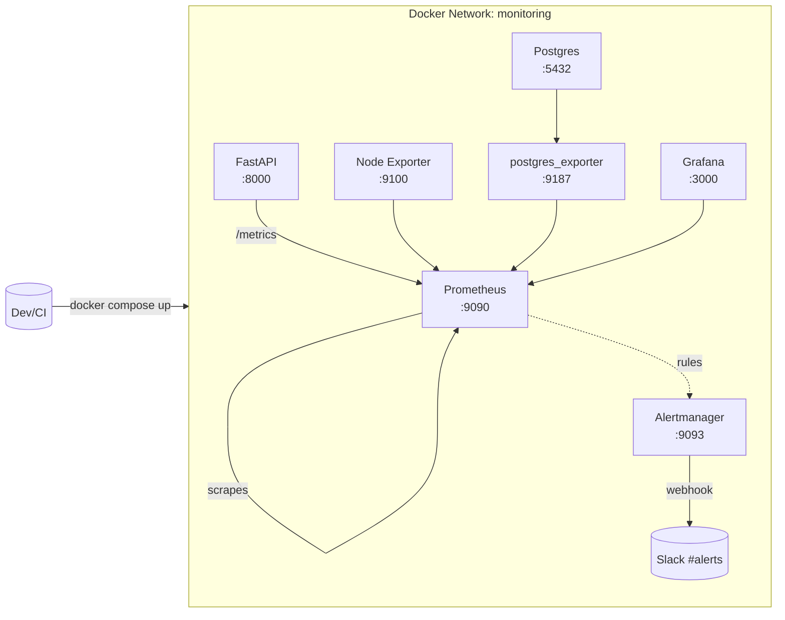

# Observability Stack: Prometheus + Grafana + Alertmanager + Exporters

[](https://github.com/amusteikis/fastapi-prometheus-grafana-stack/actions/workflows/ci.yml)


> A ready-to-use observability stack for demos/MVPs: metrics, dashboards, and Slack alerts.  
> Includes cross-platform scripts (Bash/PowerShell) and CI in GitHub Actions with smoke tests.

---

## 📌 Contents
- [Architecture](#-architecture)
- [Features](#-features)
- [Stack](#️-stack)
- [Requirements](#-requirements)
- [Quickstart](#-quickstart)
- [Validation](#-validation)
- [Endpoints](#-endpoints)
- [Slack Alerts](#-slack-alerts)
- [Project Structure](#-project-structure)
- [Screenshots](#-screenshots)
- [Use Cases](#-use-cases)
- [Learnings & Challenges](#-learnings--challenges)
- [Roadmap](#️-roadmap)
- [License](#-license)

---

## 🏗️ Architecture



---

## ✨ Features
- **Prometheus**: scrapes API, Node Exporter, and Postgres Exporter.  
- **Grafana**: dashboards (Node Exporter full + custom).  
- **Alertmanager**: sends alerts to Slack (webhook managed as a secret).  
- **Scripts**: `start.sh` / `start.ps1` (startup + validation), `validate.ps1`.  
- **CI**: workflow spins up the stack, runs smoke tests, uploads logs if it fails.  

---

## ⚙️ Stack
- Prometheus, Alertmanager, Grafana  
- node-exporter, postgres_exporter  
- Demo FastAPI app (exposing `/metrics`)  
- Docker & Docker Compose  

---

## 📋 Requirements
- Docker Desktop / Docker Engine 20+  
- Git  
- (Optional) PowerShell 7+ for `start.ps1` / `validate.ps1`  

---

## 🚀 Quickstart

### Bash (Linux/macOS/WSL)
```bash
chmod +x start.sh
./start.sh
```

### PowerShell (Windows)
```powershell
Set-ExecutionPolicy -Scope Process Bypass
.\start.ps1
```

> Variables such as URLs and credentials are read from `.env` (not versioned). See `.env.example`.

---

## ✅ Validation

- **Local**: the `start` script already validates everything.  
- **Manual**:
```powershell
pwsh ./validate.ps1 -Retries 60 -SleepSecs 5
```

Checks performed:
1. Prometheus `/-/healthy` and active targets  
2. Grafana `/api/health` (+ datasources if credentials provided)  
3. Alertmanager `/-/ready` and `/api/v2/status`  

---

## 🌐 Endpoints
- Prometheus: `http://localhost:9090` → `/targets`, `/alerts`  
- Grafana: `http://localhost:3000` → dashboards  
- Alertmanager: `http://localhost:9093` → `/#/alerts`, `/#/status`  
- Demo API: `http://localhost:8000` → `/metrics`  

---

## 🔔 Slack Alerts
- Webhook **is not in the repo**. It’s mounted from `./alertmanager/slack_webhook_url` into `/run/secrets/slack_webhook_url`.  
- CI uses a dummy webhook to avoid exposing secrets.  
- To test, enable the dummy rule:  

```yaml
- alert: AlwaysFiring
  expr: vector(1)
  for: 0s
  labels: { severity: critical }
  annotations:
    summary: "Test Alert"
    description: "Slack end-to-end test"
```

---

## 📂 Project Structure
```
.
├── docker-compose.yml
├── start.sh / start.ps1
├── validate.ps1
├── prometheus/
│   ├── prometheus.yml
│   └── rules/*.yml
├── alertmanager/
│   ├── alertmanager.yml
│   └── slack_webhook_url        # (local, not versioned)
├── grafana/                     # (optional: provisioning)
├── src/                         # demo API
└── .github/workflows/ci.yml
```

---

```md


```

---

## 💡 Use Cases
- SMEs that need **basic infrastructure and DB visibility**.  
- Technical demos and **team onboarding** into observability.  
- Lab environment for **alert testing** and playbooks.  

---

## 📚 Learnings & Challenges
- Secure handling of secrets (webhook in file/secret, not in repo).  
- Timing in CI: added retries for Prometheus to register targets.  
- Consistent `job_name` labels across exporters and dashboards.  

---

## 🛣️ Roadmap
- [ ] Provision dashboards by file/API  
- [ ] HTTPS with Nginx/Traefik (self-signed locally)  
- [ ] Deploy to **staging** + manual gate to **production**  
- [ ] Blue/Green or Canary Deployment  
- [ ] Load testing & SLO-based alerts  

---

